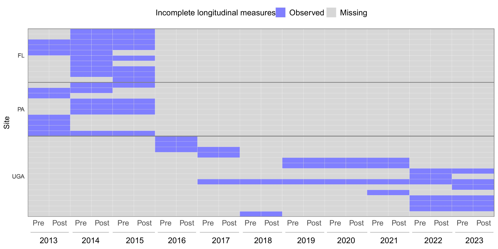
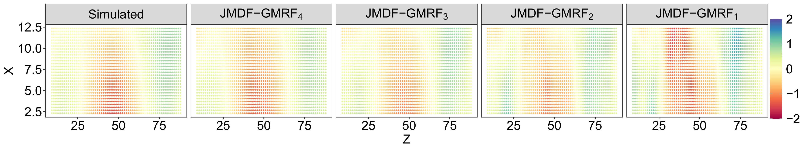
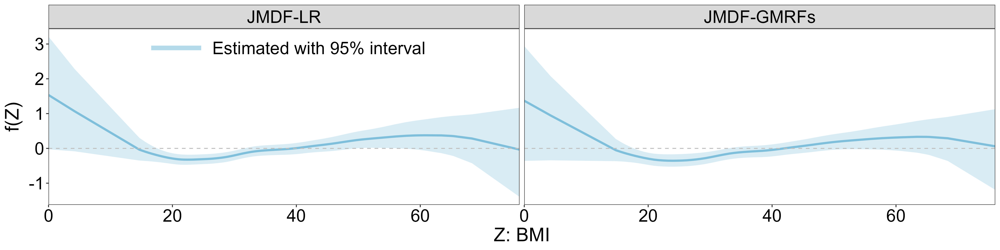
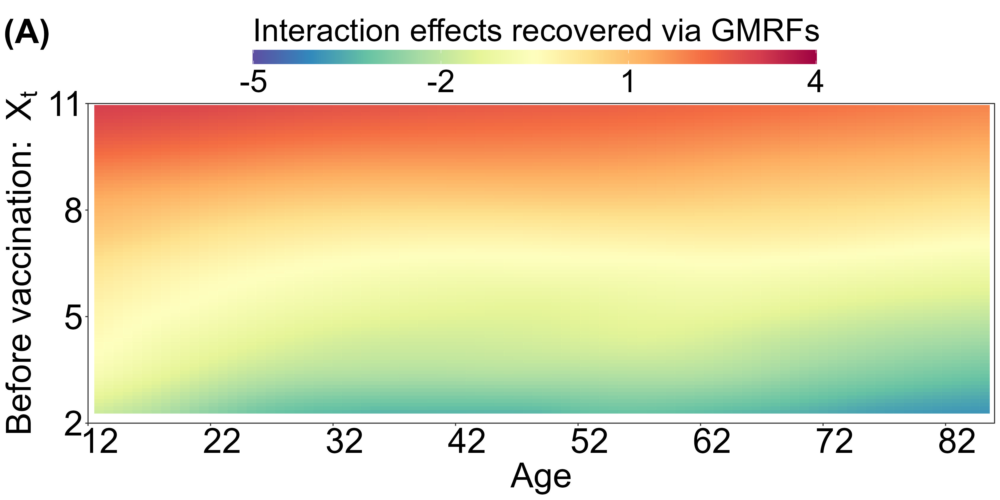
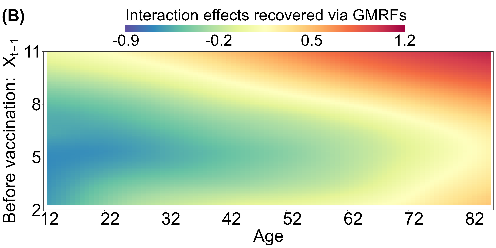
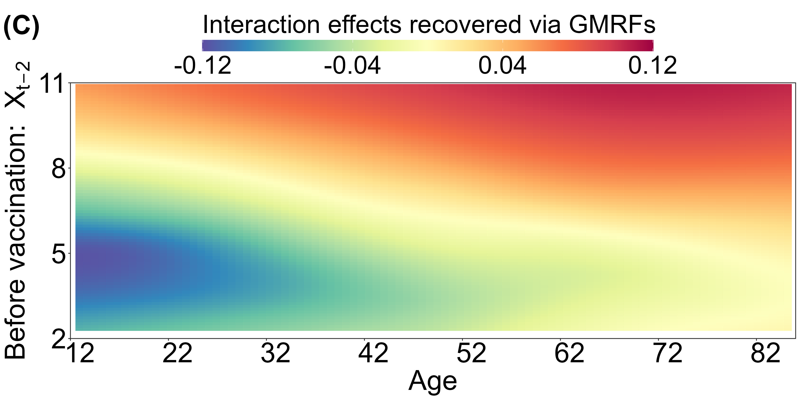
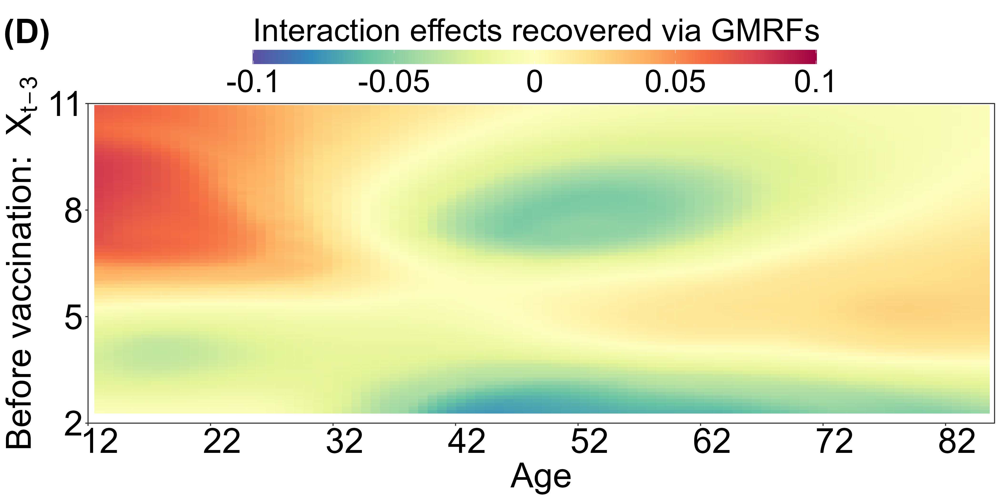

# Joint Modeling and Dynamic Ensemble Forecasting of Influenza Vaccine Responses from Complex Longitudinal Trajectories

This Github page provides code for reproducing the results in the manuscript: Joint Modeling and Dynamic Ensemble Forecasting of Influenza Vaccine Responses from Complex Longitudinal Trajectories.

## Real-world implications
The forecasts and simulations using advance statistics models can enhance our understanding of vaccine-induced immunity, aligning well with the goals of the [Computational Models of Immunity to Pertussis Booster Vaccinations (CMI-PB) Project](https://www.cmi-pb.org/blog/prediction-challenge-overview/).
## Summary
Longitudinal measurement trajectories have become increasingly valuable for deepening our predictive understanding of vaccine-induced immunity. However, the complexity of immune interaction patterns inherent in these trajectories, along with their incompleteness and high heterogeneity, introduces significant methodological challenges for predictive modeling. To address these challenges, we introduce the Joint Modeling and Dynamic Forecasting (JMDF) framework to enhance vaccine response prediction. JMDF provides four key advances: (1) adaptive use of non-missing longitudinal measurements as covariates without requiring imputation; (2) a novel application of Gaussian Markov random fields (GMRFs) to capture longitudinal interactions between demographic factors and vaccination-related measurements; (3) joint forecasting of responses to multiple vaccine subtypes while allowing them to share structured dependence; and (4) an efficient ensemble forecasting strategy that integrates sub-JMDF models. This work advances modern statistical modeling in public health, particularly in the area of vaccine response prediction and immune response simulation, with the potential to support personalized vaccination strategies.

## Data from the human influenza vaccine cohort study
To understand vaccine-induced immunity, an ongoing human influenza vaccine cohort study is being conducted. The cohort was initiated in 2013 at two sites: one in Florida (FL) and the other in Pennsylvania (PA). Since 2016, the study has been primarily conducted at the [University of Georgia (UGA) in Athens, Georgia, United States](https://cider.uga.edu/about-cider). Data were illustrated in <a href="#Figure1">Figure 1</a>.
<figure id="Figure1">
  <table align="center">
    <tr>
      <td></td>
    </tr>
  </table>
  <figcaption align="center">
    <strong>Figure 1:</strong> Incomplete longitudinal trajectories of pre- and post-vaccination HAI titers collected from 30 randomly selected participants over eleven years.
  </figcaption>
</figure>

## Simulations
<!-- The estimates of the nonlinear function closely match the true function and remain remarkably robust across several different choices of the number of knots used in the RW2 approximation, as shown in <a href="#Figure3">Figure 1</a>. 
<figure id="Figure1">
  <table align="center">
    <tr>
      <td></td>
    </tr>
  </table>
  <figcaption align="center">
    <strong>Figure 1:</strong> Estimated smoothing functions using different numbers of knots in the RW2 approximation when N = 1,500.
  </figcaption>
</figure>
-->
By comparing the four recovered maps (right panels of <a href="#Figure2">Figure 2</a>) with the corresponding true GPs (left panels), the JMDF model accurately identifies each of the latent processes.
<figure id="Figure2">
    

  
  

  <figcaption>
 <strong>Figure 2:</strong> Two-dimensional surfaces. The four panels from left to right show the true smooth surface g(x, z) = sin(0.1x) cos(0.1z) + 0.001xz, and its approximations using the GMRF G0
</figure>

## Real data analysis using the UGA cohort
Methods consistently reveal similar nonlinear associations between BMI and vaccination responses, showing positive effects at both low and high BMI levels, as shown in <a href="#Figure3">Figure 3</a>. 
<figure id="Figure3">
  <table align="center">
    <tr>
      <td></td>
    </tr>
  </table>
  <figcaption align="center">
    <strong>Figure 3:</strong> Estimated nonlinear functions with respect to BMI, along with 95% credible intervals via PLM and JMDF-GMRF.
  </figcaption>
</figure>

  
The following maps characterize the interaction effects between human age and historical longitudinal pre-vaccination HAI titers on future vaccination responses.
<figure id="Figure4">
  <table align="center">
    <tr>
      <td></td>
      <td></td>
    </tr>
    <tr>
      <td></td>
      <td></td>
    </tr>
  </table>
  <figcaption align="center">
    <strong>Figure 4:</strong> Recovered Gaussian Markov random fields between human age and longitudinal pre-vaccination HAI titers.
  </figcaption>
</figure>
